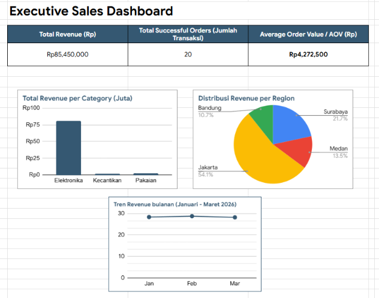

# Excel Executive Sales Dashboard

Tools: Google Sheets

## Business Problem & Context

TokoKita, an e-commerce company in Indonesia, needed a clear executive overview of its sales performance to understand revenue drivers and transaction trends. 

The raw transactional data provided by the system was fragmented, contained duplicate records, inconsistent naming conventions, and whitespace issues. The goal of this project was to:

1. Clean and audit the raw dataset.
2. Transform unstructured data into standardized metrics.
3. Build an interactive sales dashboard in Excel / Google Sheets to give business stakeholders real-time visibility into revenue, successful orders, and category distribution.

## Dataset Overview

The dataset contains transactional records capturing customer orders, item categories, transaction values, and payment status.

Total Records: Raw data logs (5 cleaned unique order records)
Primary Columns: Transaction_ID, Customer_Name, Category, Sales_Amount, Payment_Status

Key Metrics Analyzed:
1. Total Revenue (SUCCESS status)
2. Total Successful Orders
3. Average Order Value (AOV)

### Data Dictionary

| Field Name | Data Type | Description | Example |
| :--- | :--- | :--- | :--- |
| Transaction_ID | String | Unique identifier for each order | TRX001 |
| Customer_Name | String | Name of the customer placing the order | Budi Santoso |
| Category | String | Product classification | Elektronika, Pakaian, Kecantikan |
| Sales_Amount | Numeric | Gross monetary value of the transaction (in IDR) | 1500000 |
| Payment_Status | String | Status of the transaction | SUCCESS, PENDING, FAILED |

## Methodology & Tools

### Tools Used
Microsoft Excel / Google Sheets (Data Cleaning, Aggregation, & Dashboard Building)

### Workflow Steps

1. Data Cleaning & Auditing: Applied deduplication to eliminate repeated order records, utilized TRIM() to remove leading/trailing spaces, and PROPER() to standardize text capitalization across customer names and categories.
2. Logic & Conditional Tagging: Built status flags using nested IF() statements to differentiate valid sales from pending or failed transactions.
3. Data Aggregation: Applied SUMIFS() and COUNTIFS() formulas to calculate total valid revenue and category-specific order counts.

### Data Visualization & Dashboard: 

## Key Insights
1. Core Contributor: The Elektronika category is the primary driver of gross revenue, contributing Rp81,000,000 out of the total Rp85,450,000 in successful sales.
2. Geographic Distribution: Jakarta represents the largest customer market share, accounting for 54.1% of total sales volume.
3. Stability in Performance: Monthly sales trend shows steady consistency across the analyzed quarter (~Rp28M per month).

## Business Recommendations
1. Focus Marketing Capital on Top Performers: Allocate a larger portion of the advertising budget to Elektronika in high-converting regions like Jakarta to maximize ROI.
2. Implement AOV Uplift for Low-Ticket Categories: Create cross-selling strategies or product bundles pairing low-priced items (Pakaian and Kecantikan) with high-demand electronics to increase total cart value.
3. Improve Conversion in Secondary Markets: Investigate why regions like Bandung and Medan show lower sales percentages and test localized promotions or free shipping thresholds.

